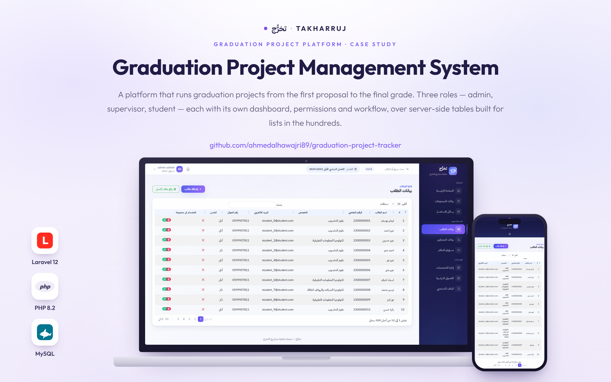

<p align="center">
  
</p>

# تخرُّج — Takharruj

A platform that manages graduation projects from the first idea to the final grade — with three separate roles, each getting its own dashboard, its own permissions and its own workflow.

---

## The problem it solves

Graduation projects are usually run on spreadsheets, email threads and paper. Nobody has a single answer to "which groups have no supervisor yet", "which milestones are overdue" or "where is the latest version of that file". This system puts all of that in one place, and gives each role only the part that concerns them.

---

## The three roles

**Admin** runs the semester. Adds and manages students, supervisors, specialisations and academic terms — including bulk import from Excel, which matters when a new intake is 300 rows. Forms project groups, assigns supervisors, and maintains the catalogue of proposed project topics per specialisation. The dashboard is backed by periodic stat snapshots rather than recalculating everything on every page load.

**Supervisor** reviews the project requests that come in, accepts or rejects them, then tracks each supervised project: its milestones, its submitted files, and the discussion around them. Comments on student work, records the final evaluation, and can look back at previous semesters through the archive.

**Student** proposes a project, joins a group, follows the milestone timeline and its deadlines, uploads deliverables, and replies to supervisor comments — with a profile and notifications of their own.

---

## Features

- Three role-scoped dashboards with separate route groups and permissions
- Excel import for students and supervisors, plus data export
- Group formation and supervisor assignment
- Project proposal, review, acceptance and rejection flow
- Milestone tracking with deadlines
- File submissions per project, with a dedicated file controller
- Threaded comments between student and supervisor
- Final evaluation recorded against the project
- Semester management with an active-term flag and an archive of past terms
- Server-side data tables, so large lists stay fast
- Contact messages from the public site
- A separate Next.js marketing front end

---

## Design system

Every part of the product — the public site, the login screen and all three dashboards — is driven by a single documented token layer, written up in [`DESIGN_SYSTEM.md`](DESIGN_SYSTEM.md). Colours, radii, shadows and motion are defined once in two stylesheets and never hard-coded inside a page. Changing the brand means editing two files, not forty.

---

## Tech stack

**Back end** — Laravel 12, PHP 8.2, MySQL, Laravel Sanctum
**Tables and files** — Yajra DataTables (server-side), Maatwebsite/Excel (import and export)
**Views** — Blade, with a shared component layer (`page-header`, `kpi-card`, `status-badge`, `empty-state`, `attention-card`)
**Marketing front end** — Next.js 14, React 18, Framer Motion, Lenis, Tailwind CSS

---

## Getting started

### Laravel application

```bash
composer install
npm install

cp .env.example .env
php artisan key:generate
```

Set your database credentials in `.env`, then:

```bash
php artisan migrate --seed
php artisan storage:link      # required for project file uploads

npm run dev
php artisan serve             # http://localhost:8000
```

### Next.js front end

```bash
cd frontend
npm install
cp .env.local.example .env.local
npm run dev                   # http://localhost:3000
```

---

## Project structure

```
app/Models/                        Project, Group, Student, Supervisor, Semester,
                                   Specialize, ProjectMilestone, ProjectFile,
                                   ProjectComment, StatSnapshot, Admin, Contact
app/Http/Controllers/Admin/        students, supervisors, groups, semesters,
                                   specialisations, project catalogue, contacts
app/Http/Controllers/Supervisor/   dashboard, project management, profile
app/Http/Controllers/Student/      dashboard, files, comments, profile
app/Http/Controllers/FileController.php   uploads and downloads
resources/views/dashboard/         role-scoped dashboards
resources/views/components/        shared Blade UI components
resources/views/layouts/admin/     shell, header, sidebars per role
public/assets/css/premium.css      design tokens — public site
public/css/dashboard.css           design tokens — dashboards
frontend/                          Next.js marketing site
DESIGN_SYSTEM.md                   the single source of visual truth
```

---

## Author

**Ahmed Al-Hawajiri** — Full-Stack Developer
[GitHub](https://github.com/ahmedalhawajri89) · [LinkedIn](https://www.linkedin.com/in/ahmedalhawajri)

Licensed under the MIT License.

---

<div dir="rtl">

## نبذة بالعربية

**تخرُّج** منصة لإدارة مشاريع التخرّج من أول فكرة حتى الدرجة النهائية، مبنية على **ثلاثة أدوار منفصلة** لكل واحد منها لوحة تحكم وصلاحيات ومسار عمل خاص.

**الأدمن** يدير الفصل الدراسي: الطلاب والمشرفون والتخصصات والفصول، مع استيراد جماعي من Excel، وتكوين المجموعات وإسناد المشرفين، وإدارة قائمة المواضيع المقترحة.

**المشرف** يراجع طلبات المشاريع ويقبلها أو يرفضها، ثم يتابع المراحل والملفات المسلَّمة، ويعلّق على عمل الطلاب ويسجّل التقييم النهائي، مع أرشيف للفصول السابقة.

**الطالب** يقدّم مقترح مشروعه، ينضم لمجموعة، يتابع المراحل ومواعيدها، يرفع التسليمات، ويرد على تعليقات المشرف.

**ملاحظة على التصميم:** الموقع العام وصفحة الدخول واللوحات الثلاث كلها مبنية على طبقة توكنز واحدة موثّقة في `DESIGN_SYSTEM.md` — الألوان والزوايا والظلال والحركة معرّفة مرة واحدة في ملفين، وممنوع كتابتها يدوياً داخل الصفحات. تغيير الهوية البصرية يعني تعديل ملفين لا أربعين.

**التقنيات:** Laravel 12 و PHP 8.2 و MySQL و Sanctum، مع Yajra DataTables و Maatwebsite Excel، وواجهة تعريفية منفصلة بـ Next.js 14.

</div>
